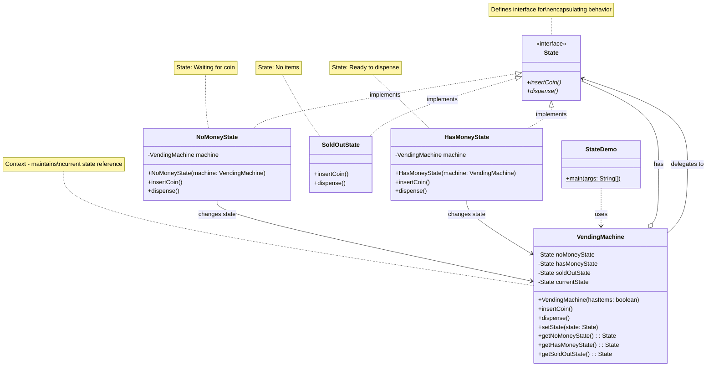
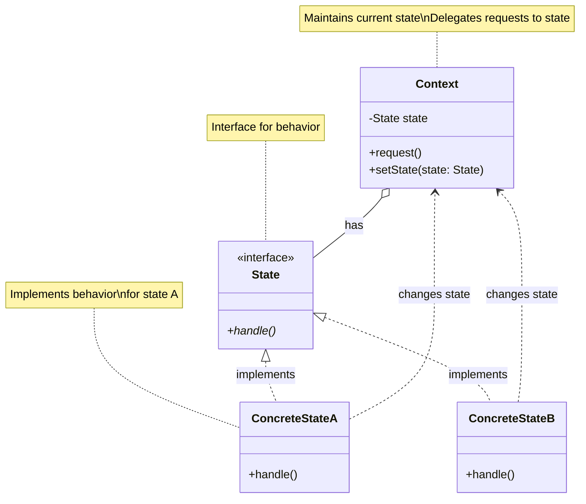
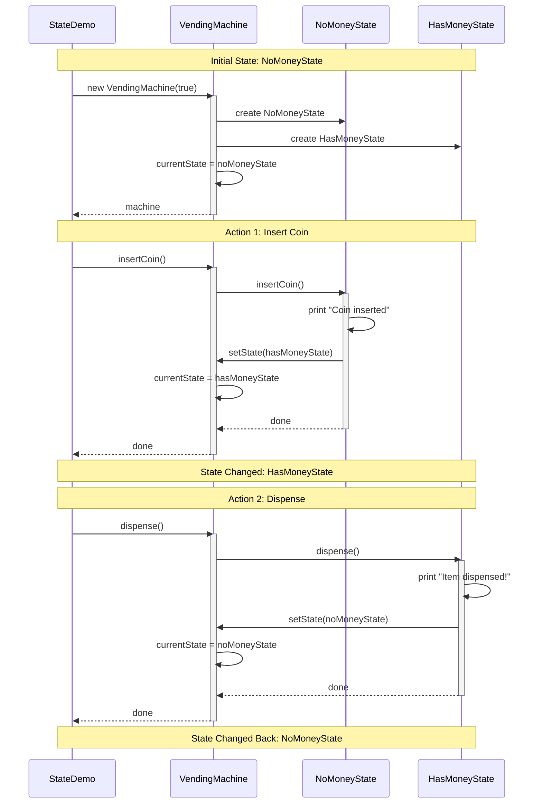
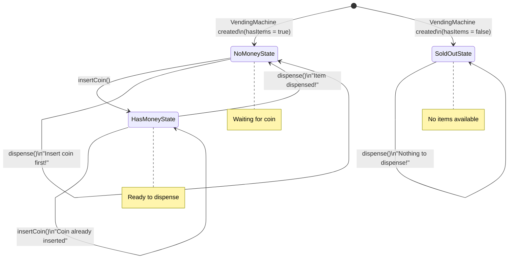
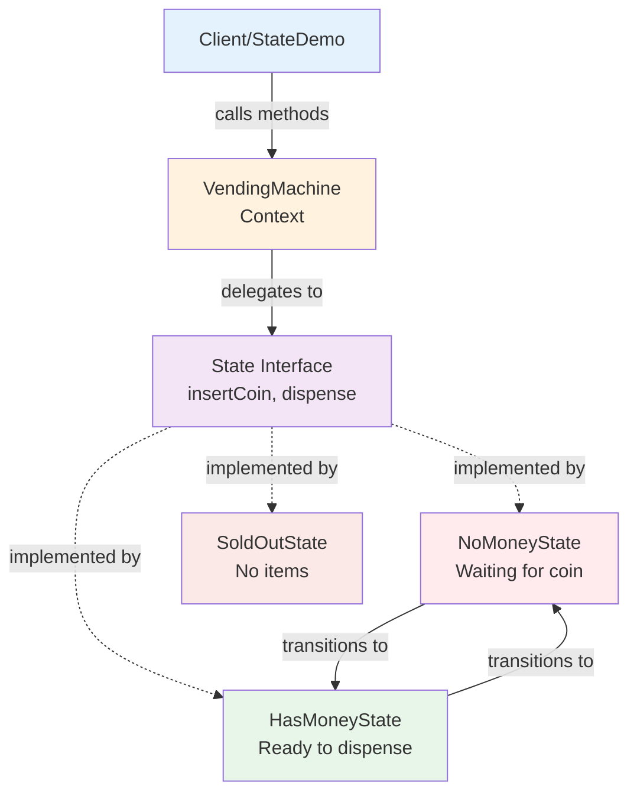
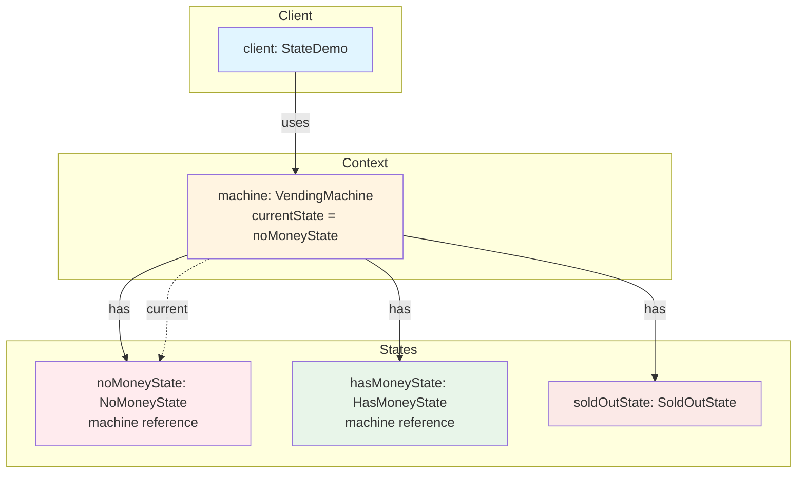

# State Pattern - Vending Machine System

**Type**: Behavioral Design Pattern

## Definition

**State Pattern**: Allow an object to alter its behavior when its internal state changes. The object will appear to change its class.

**Purpose**: Encapsulate varying behavior for the same object based on its internal state.

**Problem**: 
- Vending machine has different behaviors based on its state (No Money, Has Money, Sold Out)
- Using multiple if-else statements makes code complex and hard to maintain
- Difficult to add new states without modifying existing code

**Solution**: 
Create separate state classes for each state, and delegate behavior to the current state object.

---

## UML Diagrams

### 1. Complete Class Diagram

---

### 2. State Pattern Structure (Generic)

---

### 3. Sequence Diagram - State Transitions

---

### 4. State Transition Diagram

---

### 5. Component Interaction Diagram

---

### 6. Object Diagram - Runtime Instance

---

## Pattern Components

| Component | Class | Description |
|-----------|-------|-------------|
| **Context** | VendingMachine | Maintains current state reference |
| **State Interface** | State | Defines common interface for all states |
| **Concrete State 1** | NoMoneyState | Behavior when waiting for coin |
| **Concrete State 2** | HasMoneyState | Behavior when ready to dispense |
| **Concrete State 3** | SoldOutState | Behavior when no items available |

---

## State Behaviors

| State | insertCoin() | dispense() |
|-------|-------------|-----------|
| **NoMoneyState** | Accept coin → Change to HasMoneyState | Display "Insert coin first!" |
| **HasMoneyState** | Display "Coin already inserted" | Dispense item → Change to NoMoneyState |
| **SoldOutState** | Display "Machine sold out!" | Display "Nothing to dispense!" |
